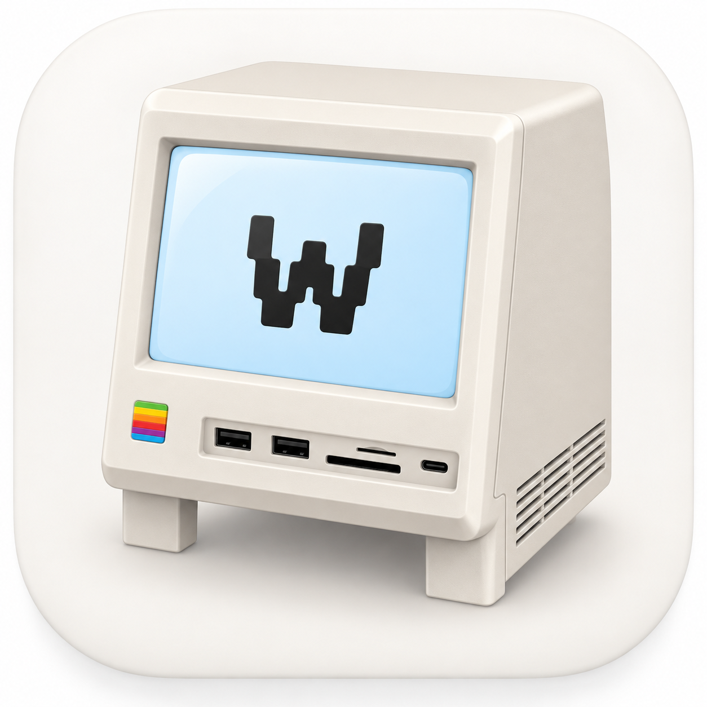

# Wokyintosh

### A retro Macintosh-inspired system monitor for macOS.

A small native macOS dashboard for system stats, weather, and Now Playing — styled like a classic Macintosh.

[**Download Wokyintosh 1.0.0**](https://github.com/SalarFarahani/Wokyintosh/releases/tag/v1.0.0)

---

## What it does

Wokyintosh turns a Mac display into a compact retro dashboard with live information from your system.

- Live CPU usage
- Live RAM usage
- SSD usage
- Network activity
- Apple Music Now Playing
- Spotify Now Playing
- Album artwork
- Local weather
- Automatic light / dark appearance following macOS
- Short classic-Mac-inspired startup screen
- Native macOS app built with AppKit + WebKit

## Why Wokyintosh?

Wokyintosh started as a dashboard for a small external display used with a Mac mini setup.

The goal is simple: useful live information, very little visual noise, and a playful classic-Macintosh feel.

> Wokyintosh — A Mac System Monitor for Team Wokyis, by Salar Farahani ;-)

## Download

### Latest release

**[Download Wokyintosh 1.0.0](https://github.com/SalarFarahani/Wokyintosh/releases/tag/v1.0.0)**

Requires **macOS 13 Ventura or later**.

After downloading:

1. Extract `Wokyintosh-1.0.0-macOS.zip`.
2. Move `Wokyintosh.app` to your Applications folder.
3. Open Wokyintosh.

### Gatekeeper notice

Wokyintosh 1.0 is currently distributed without an Apple Developer ID and is **not notarized by Apple**.

macOS may therefore block the first launch.

If that happens:

1. Control-click or right-click `Wokyintosh.app`.
2. Choose **Open**.
3. If macOS still blocks it, go to **System Settings → Privacy & Security**.
4. Choose **Open Anyway** for Wokyintosh.

Only bypass Gatekeeper for a copy downloaded from this official repository.

## Permissions

Wokyintosh may request:

- **Location** — used to display local weather.
- **Automation access** — used to read Now Playing information from Apple Music or Spotify.

## Privacy

Wokyintosh is designed to run locally on your Mac.

- System statistics are read locally.
- No Wokyintosh account is required.
- Version 1.0 does not include analytics.
- Weather uses your approximate location when permission is granted.
- Playback information is read locally through macOS automation.

## Build from source

Wokyintosh can be built using Apple's Command Line Tools. The full Xcode application is not required for the current build workflow.

1. Clone or download this repository.
2. Run:

   `Build Wokyintosh.command`

3. The app will be created at:

   `build/Wokyintosh.app`

To create the ZIP used for GitHub Releases, run:

`Package Release.command`

The release package will be created at:

`dist/Wokyintosh-1.0.0-macOS.zip`

## Tech

- Swift
- AppKit
- WebKit / WKWebView
- Core Location
- Native macOS system APIs
- AppleScript integration for Apple Music / Spotify

## Current status

### Version 1.0.0

Released September 2026.

Current focus:

- Stability
- UI polish
- Better display/window controls
- User-configurable settings
- Theme controls
- Easier distribution

## Feedback

Found a bug or have an idea?

Use [GitHub Issues](https://github.com/SalarFarahani/Wokyintosh/issues).

Bug reports and feature requests are welcome.

## License

Wokyintosh is released under the [MIT License](LICENSE).

---

Made for macOS by **Salar Farahani**

